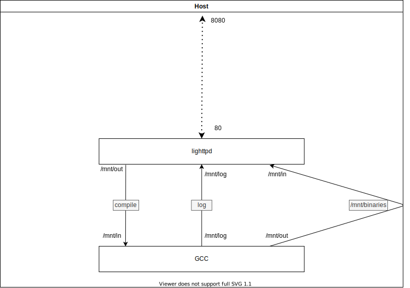

# RemoteGCC
MI4 - Remote GCC compiler with docker images

##  What's embedded ?

Two images, both built on top of the `debian:stable` image.

The former is a straightforward web-app, handled by [Lighttpd](https://www.lighttpd.net/).

The latter is a GCC compiler, which receives source codes from the web-app, builds binaries and bring them in a persistent volume: `./binaries`.



## How to use
`cd` into the REMOTEGCC directory then run:
```bash
docker-compose up
```

In a web browser of your choice
copy/paste the following link: [http://localhost:8080/](http://localhost:8080/)

1. add your `.c` files (with `.h` and `makefile` if necessary). If no `makefile` is present, all `.c` files will be independently compiled.
2. click `Compile`
3. watch `gcc` logs
4. download the output binaries (also available in `./binaries`)

## Rid of default values?

They are available in `.env`.

```bash
# .env will be used by docker-compose for modified environment values
# edit values with your modified values
vi .env
```

Need to reset environment values?<br/>
```bash
cp .env.sample .env
```